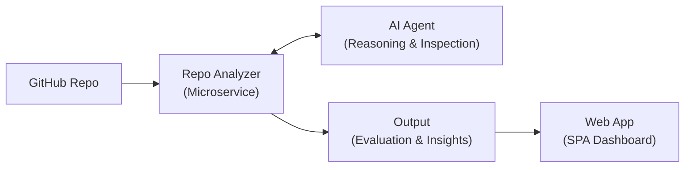

# Repo Analyzer & Architecture Auditor

An intelligent, agent-driven repository analysis system that fetches codebases and evaluates application architecture, ideology, methodology, and software principles.

---

## 1. High-Level Architecture



- **GitHub Repo (Input)**: Ingests repository link, triggers shallow fetch / cloning or GitHub API extraction.
- **Repo Analyzer (Microservice Engine)**:
  - Ingestion, tree parsing, language/dependency identification, and file indexing.
  - Exposes exploration tools and context to the AI Agent.
  - Aggregates evaluations and coordinates output synthesis.
- **AI Agent**:
  - Dynamically inspects code structures, entry points, configuration files, and architectural boundaries.
  - Evaluates patterns, idioms, and anti-patterns against established software principles.
- **Output & Web App**:
  - Produces structured scorecards, architectural breakdowns, methodology adherence reports, and actionable refactoring advice.
  - Visualized within an interactive Single Page Application.

---

## 2. Repository Structure

```text
beta/
├── README.md
├── repoAnalyzer/       # Microservice for repo ingestion & AI agent orchestration
└── web-app/            # Single Page Application (SPA) frontend
```

---

## 3. Technology Stack

### A. `repoAnalyzer` (Microservice)
- **Language & Runtime**: Python 3.11+
- **API Framework**: FastAPI + Uvicorn
- **Data Validation & Settings**: Pydantic v2 & `pydantic-settings`
- **Observability & Metrics**:
  - OpenTelemetry (tracing & distributed instrumentation)
  - Prometheus (metrics collection & export)
  - `structlog` (structured JSON logging)
- **State & Messaging**:
  - Redis (caching, job state, deduplication)
  - RabbitMQ / Kafka / NATS (asynchronous analysis task queue & event streaming)
- **Database / ORM**: SQLAlchemy 2.0 (Alembic not required)
- **Code Quality & Typing**: `mypy` (strict static typing)

### B. `web-app` (Frontend)
- **Framework & Tooling**: ReactJS + Vite (dev server & build tool)
- **Architecture**: Single Page Application (SPA) — no demo/bloat pages
- **Styling**: Tailwind CSS v4 + shadcn CSS-first approach
- **Typography & Theme**:
  - Fonts: Geist (`--font-sans`) and Geist Mono (`--font-mono`)
  - Color Tokens: Strict OKLCH color palette (zinc surfaces with cyan primary and lime accents)
  - Theme Definitions: Defined strictly via `tailwind.config.ts` and `globals.v4.css` (no ad-hoc token additions)

### C. `AI Agent`
- **Status**: Framework & LLM Provider to be decided (e.g., Gemini, Claude, OpenAI, or local Ollama).
- **Capabilities**: Repository exploration, structural querying, file path tracing, dependency direction checks, and holistic principle scoring.

---

## 4. Evaluation Rubrics & Core Criteria

The AI Agent evaluates codebases across four foundational dimensions:

1. **Application Architecture**:
   - Clean Architecture, Hexagonal / Ports & Adapters, Modular Monolith, Layered, or Microservices.
   - Separation of concerns, domain isolation, dependency inversion across layers.
2. **Ideology & Design Philosophy**:
   - Domain-Driven Design (DDD), Object-Oriented vs. Functional paradigms, Declarative vs. Imperative flows.
3. **Methodology**:
   - Testing strategy (TDD/BDD, unit vs. integration vs. e2e ratio, mock usage).
   - Release readiness, CI/CD configuration, 12-factor compliance.
4. **Software Principles**:
   - SOLID principles adherence.
   - DRY (Don't Repeat Yourself), KISS (Keep It Simple, Stupid), YAGNI.
   - Robust error handling, observability hooks, and security posture.

---

## 5. Getting Started

Detailed setup instructions for both `repoAnalyzer` and `web-app` will be added as each service is scaffolded.
