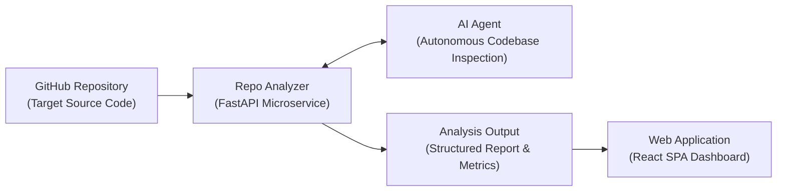

# System Requirements & Architecture Specification

## 1. High-Level Architecture

The system consists of two primary operational components: the **`web-app`** (Single Page Application user interface) and the **`repoAnalyzer`** (orchestration microservice), working in tandem with a reasoning **`AI Agent`** to analyze source code repositories.

### Component Flow
1. **GitHub Repository (Target)**: User provides a valid repository URL. The system accesses repository data via shallow clone or API.
2. **Repo Analyzer (Core Engine)**:
   - Orchestrates ingestion, tree walking, file indexing, and static extraction.
   - Manages asynchronous analysis pipelines and state transitions.
   - Provides tool interfaces and targeted file context to the AI Agent.
   - Aggregates findings and generates the final structured payload.
3. **AI Agent (Bidirectional Inspector)**:
   - Queries repository structure dynamically.
   - Evaluates architectural boundaries, methodologies, idioms, and code quality.
   - Returns structured scorecards, critiques, and rationale back to the analyzer.
4. **Output & Web Application**:
   - Structured JSON analysis output ingested and rendered by the React SPA.
   - Displays architectural breakdowns, compliance metrics, and interactive suggestions.

---

## 2. End-to-End Analysis Workflow

The analysis execution must strictly adhere to the following 8-step lifecycle:

1. **Receive Repository URL**: Receive the repository URL submitted by the user.
2. **Clone Repository**: Clone the repository into a temporary directory.
3. **Set Working Directory**: Set the cloned repository directory as the working directory.
4. **Execute CLI Invocation**: From the repository directory, execute the terminal command that invokes the CLI AI agent.
5. **Send Analysis Query**: Send the query `"analyze this repo using repo-analyzer skill"` to the AI agent using its default model.
6. **Load Skill**: The AI agent loads and applies the `repo-analyzer` skill.
7. **Perform Repository Analysis**: The AI agent analyzes the repository according to the instructions defined in the `repo-analyzer` skill and its configuration.
8. **Format & Generate Output**: Generate the analysis output strictly according to the format and requirements specified by the `repo-analyzer` skill and configuration.

---

## 3. System Architecture & Components

### 2.1 Web Application (`web-app`)
- **Type**: Single Page Application (SPA).
- **Core Stack**:
  - ReactJS with Vite (build tool & local development server).
  - Tailwind CSS v4 + shadcn's CSS-first architecture.
  - Strict OKLCH theme tokens (zinc neutrals, cyan primary `#06b6d4`, lime accent `#84cc16`).
  - Typography: Geist Sans & Geist Mono.
- **Key Responsibilities**:
  - Repository link input and validation.
  - Configuration of analysis scope and target criteria.
  - Real-time analysis status streaming and progress indicators.
  - Interactive scorecard presentation and report exploration.
  - Direct, focused interface without superfluous demo pages or fluff.

### 2.2 Repo Analyzer Microservice (`repoAnalyzer`)
- **Type**: Asynchronous Microservice.
- **Core Stack**:
  - Python 3.11+ with FastAPI & Uvicorn.
  - Data Validation: Pydantic v2 & `pydantic-settings`.
  - Database: SQLAlchemy 2.0 (synchronous/asynchronous engines, Alembic not required).
  - Caching & Fast State: Redis.
  - Message Queue: RabbitMQ / Kafka / NATS (for job queueing and background worker execution).
  - Observability: OpenTelemetry (distributed tracing), Prometheus (metrics export), `structlog` (structured logging).
  - Typing & Verification: `mypy` strict static analysis.
- **Key Responsibilities**:
  - Safe, sandboxed repository fetching and cloning.
  - File tree indexing, metadata extraction, and language detection.
  - Managing communication and tool execution for the AI Agent.
  - Storing and caching analysis results.

### 3.3 AI Agent Engine
- **Role**: Intelligent, context-aware codebase auditor invoked via CLI.
- **Invocation Context**: Executed from within the target cloned repository working directory.
- **Query Prompt**: `"analyze this repo using repo-analyzer skill"` using the agent's default model.
- **Skill Engine**: Loads and applies the `repo-analyzer` skill instructions and configuration.
- **Output Standard**: Emits structured analysis output strictly conforming to the `repo-analyzer` skill specification.

---

## 4. Analysis Evaluation Criteria

The system evaluates repositories across four core dimensions:

| Dimension | Scope of Evaluation |
| :--- | :--- |
| **Application Architecture** | Clean Architecture, Hexagonal (Ports & Adapters), Modular Monolith, Layered, Microservices; separation of concerns, dependency direction, domain isolation. |
| **Ideology & Paradigms** | Domain-Driven Design (DDD), Object-Oriented vs. Functional programming patterns, Declarative vs. Imperative data flow, convention consistency. |
| **Methodology** | Testing practices (TDD, BDD, unit vs. integration vs. e2e distribution), CI/CD pipelines, release readiness, 12-factor application compliance. |
| **Software Principles** | SOLID principles, DRY (Don't Repeat Yourself), KISS (Keep It Simple), YAGNI, defensive error handling, security posture, and observability. |

---

## 5. Functional Requirements

> [!NOTE]
> **Authentication & Access Control**: Out of scope. The application is completely open-access and public. No user accounts, sessions, logins, or authentication mechanisms are implemented so effort is concentrated 100% on the core analysis workflow.

1. **Repository Ingestion & Setup**:
   - Receive public repository URL submitted by user via `web-app`.
   - Clone repository into an isolated temporary directory.
   - Set the cloned directory as the active working directory.
2. **Agent Execution**:
   - Execute the terminal command invoking the CLI AI agent from the working directory.
   - Dispatch the query `"analyze this repo using repo-analyzer skill"` using the default model.
   - Ensure the AI agent loads and applies the `repo-analyzer` skill.
3. **Analysis Orchestration**:
   - Queue analysis requests via message broker (RabbitMQ / Kafka / NATS).
   - Track progress stages (`QUEUED`, `FETCHING`, `CLONED`, `AGENT_ANALYZING`, `COMPLETED`, `FAILED`).
   - Store results in Redis for fast caching and PostgreSQL/SQLite via SQLAlchemy for persistence.
4. **Result Presentation**:
   - Ensure analysis output adheres strictly to the `repo-analyzer` skill specification.
   - Deliver clear scores, architectural breakdowns, methodology adherence, and principles scorecard.
   - Render interactive results cleanly in the React SPA.

---

## 6. Non-Functional Requirements

- **Performance**: Asynchronous execution prevents HTTP request timeouts during long agent runs.
- **Observability**: Every analysis execution generates a trace in OpenTelemetry with correlated log entries via `structlog` and metrics emitted to Prometheus.
- **Security**: Strict validation on repository URLs; safe process execution without arbitrary shell execution vulnerabilities.
- **Maintainability**: Strict type checking via `mypy` in Python and TypeScript in the React SPA.
